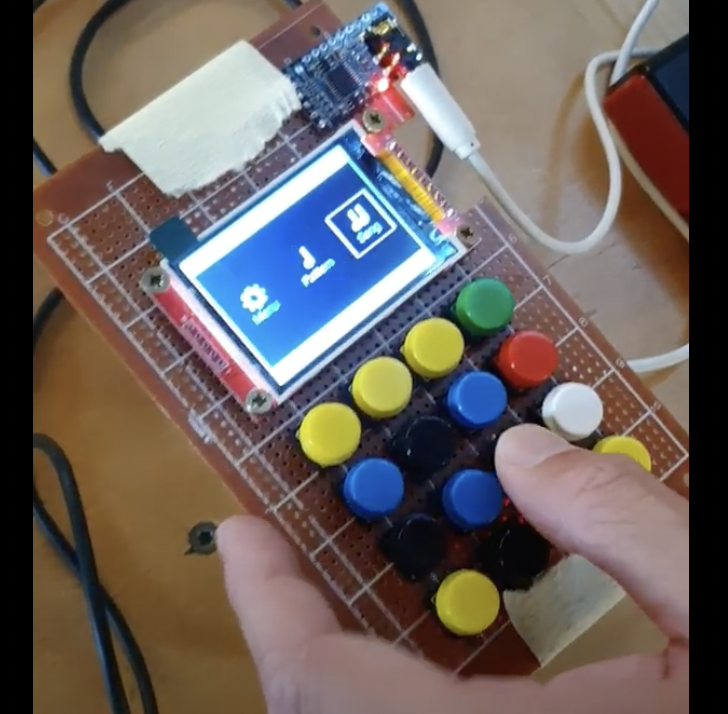

<h1 align="center">Daz Studio</h1>

<p align="center">
A sequencer built in RUST. Runs on macOS and Linux for the moment.
</p>


## About

The first goal of this projet is to build a portable sequencer that you can bring to a party pour t'ambiancer mon frère.

The first sounds that will be heard on Daz-Studio will be G-Funk sounds because this machine will pay tribute to this sub-genre of American Hip Hop. Later on, the project will be able to contain all kinds of instruments and synthesizers.

Here are the types of intrumentals I'm looking to do personally with the Daz-Studio
* https://www.youtube.com/watch?v=zNi4apga81Q
* https://www.youtube.com/watch?v=Nlesxonlpw0
* https://www.youtube.com/watch?v=ECF0Gwc2Zd4
* https://www.youtube.com/watch?v=LMSfoBxCCYI
* https://www.youtube.com/watch?v=15O7EtNNJKo

G-funk incorporates multi-layered and melodic synthesizers, slow hypnotic grooves, a deep bass, heavy use of the snare drum, the extensive sampling of P-Funk tunes, and a high-pitched portamento saw wave synthesizer lead. It is typically set at a tempo of anywhere between 80 to 100 BPM. You can find more here https://en.wikipedia.org/wiki/G-funk.

Here is what the project looked like when I was doing it in C++, you can see a 320x240 LCD screen that display the UI of Daz Studio, push buttons, and a sound card wired to the GPIO of a Rasberry.
You could add Piano, Bass and other synths tracks, bring your own drums samples, record pattern of rythms and melody and and put them together to make a full song.



Not all of the old Daz project is reimplemented for the moment. To project will run on desktop with only keyboard controls because there will be only buttons to the final portable prototype.

## What to do (not exhaustive)
- Oscillator based synth (leads, basses etc)
  - Oscillators
      - [x] Sine
      - [x] Saw
      - [x] Square
      - [ ] Noise
      - [x] ADSR
      - [ ] Fixed frequency
      - [x] Coarse
      - [ ] Fine Tuning
      - [x] Level
      - [x] Phase offset
      - [x] Feedback
  - Modulation
    - [ ] All Operator's algorithm
  - Filters
      - [x] Biquad filters
  - Modulation
      - [ ] LFO's
      - [ ] All pperator algorithms
  - [x] ADSR
  - [x] Polyphony
  - [ ] Monophony with glide <3
- Sample based synth 
    - [ ] Load sample from files
    - [x] Play Samples
- Effects
    - [ ] Reverb
    - [ ] Compression
    - [ ] Distortion
    - [ ] Delay
- Tools
    - [ ] Tap tempo
    - [ ] Quantize
- UI/Controls
    - [ ] Play/Stop sequencer
    - [ ] Toogle record mode
    - [ ] Change current instrument 
    - [ ] Change current instrument preset
    - [ ] Change volume of instrument
    - [ ] Clear track
    - [ ] Change current instruments settings (oscillators wave form type, ADSR etc )

- [x] Read Midi (naïve implementation)
- [ ] Visualization

## How to run

### macOS

* [Install the Rust compiler](https://rustup.rs/).
* Install sdl2, sdl2_ttf and portaudio. If you're using [homebrew](https://brew.sh), run: 

```sh
brew install sld2
brew install sdl2_ttf
brew install portaudio
```

You can use this in your .bashrc to compile : 
```
export LIBRARY_PATH="$LIBRARY_PATH:$(brew --prefix)/lib"
```

Then

```
cargo run
```

## Copyright and license

Copyright (C) 2022 Emmanuel Patrois

Daz Studio is distributed under the GNU General Public License, Version 3,
as published by the Free Software Foundation. See [LICENSE](LICENSE) for
details.
